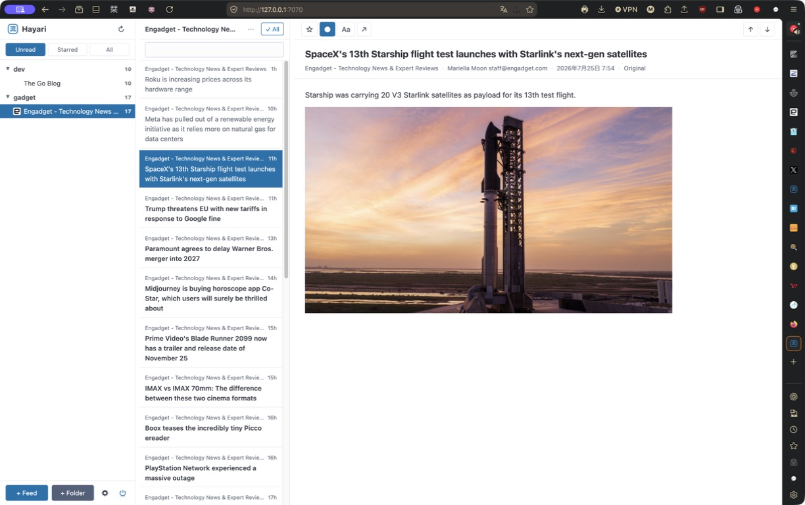

# Hayari

[日本語版](README.ja.md)

A self-hosted RSS aggregator written in Go with a vanilla JS frontend.
The name Hayari comes from the Japanese word 「流行り」, meaning a trend or something in vogue.

## Features

- Single binary with embedded frontend assets
- SQLite database (no external DB required)
- Desktop tray icon support (build with `gui` tag)
- FreshRSS `greader.php`-compatible API subset
- Per-feed title keyword exclusions (literal substring match)
- Pico CSS based lightweight UI

## Screenshot

Feeds, unread counts, article list, and reading pane after adding feeds. The
Engadget feed is selected with an article open.



## Keyboard shortcuts

| Key | Action |
| --- | --- |
| `j` / `k` | Select the next / previous article |
| `l` / `h` | Select the next / previous feed or folder |
| `o` | Open the selected article in the browser |
| `r` | Toggle the selected article's read state |
| `s` | Toggle the selected article's star |
| `i` | Toggle readability mode |
| `q` | Close the article pane |
| `f` / `b` | Scroll the article down / up |
| `/` | Focus search |
| `Shift+R` | Mark all articles in the current view as read |
| `1` / `2` / `3` | Switch to Unread / Starred / All |

Shortcuts are disabled while typing in an input field or while a dialog is open.

## Building

```sh
# Server-only build
make build

# Desktop tray build
make build-gui
```

## Running

```sh
./hayari --addr 127.0.0.1:7070 --db path/to/hayari.db --user your-user --pass your-password
```

## Secure deployment

Hayari does not provide TLS itself. Run it only behind a TLS-terminating reverse proxy such as Caddy or nginx:

```text
Browser / RSS client -- HTTPS --> reverse proxy -- HTTP --> Hayari (127.0.0.1:7070)
```

- Bind Hayari to `127.0.0.1`; do not expose its HTTP listener directly to the internet.
- Configure the reverse proxy to redirect HTTP to HTTPS.
- Always configure `--user` and `--pass` in production. Without both, Hayari permits requests without authentication for local development.
- Hayari refuses an unauthenticated listener outside loopback by default. `--allow-insecure-no-auth` overrides this only for intentional local/testing use.
- Treat the proxy access log as sensitive because it includes requested URLs.
- When the proxy terminates HTTPS, start Hayari with `--secure-cookie` so browser session cookies are sent only over HTTPS.

### Google Reader login

`POST /accounts/ClientLogin` is the default and supported login method. Credentials in a GET query can be recorded in proxy access logs, so GET is disabled by default.

For a legacy client that requires GET, explicitly opt in:

```sh
./hayari --allow-greader-login-get
```

Use this only behind HTTPS and restrict access to proxy logs.

## API

Hayari implements a FreshRSS `greader.php`-compatible subset of the Google
Reader API. Both endpoint forms provide the same API:

- Google Reader form: `/accounts/ClientLogin` and `/reader/api/0/...`
- FreshRSS form: `/api/greader.php/accounts/ClientLogin` and
  `/api/greader.php/reader/api/0/...`

The implementation is verified with ReadKit and NetNewsWire. It supports
authentication, subscription and folder synchronization, unread and starred
state, article retrieval, `edit-tag`, and mark-all-as-read.

It is not a complete implementation of either API. For example, `rename-tag`
and `disable-tag` are not implemented because they are outside the verified
client workflows. See [the API reference](docs/freshrss-api.md) for the
supported endpoint set and limitations.

## License

MIT
