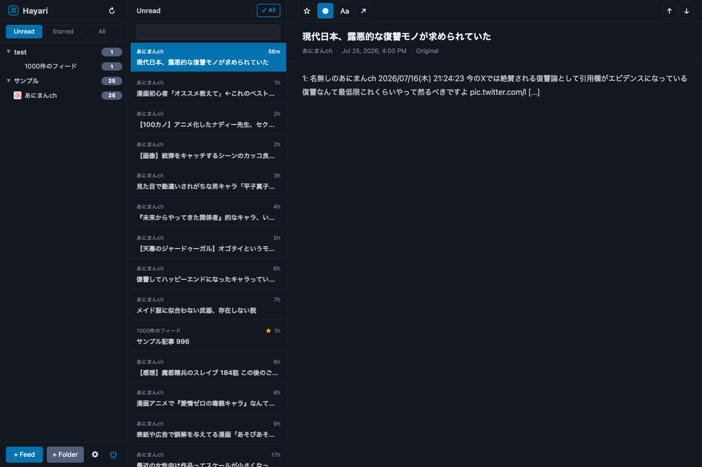

# Hayari

A self-hosted RSS aggregator written in Go with a vanilla JS frontend.

## Features

- Single binary with embedded frontend assets
- SQLite database (no external DB required)
- Desktop tray icon support (build with `gui` tag)
- FreshRSS / Google Reader API compatible
- Per-feed title keyword exclusions (literal substring match)
- Pico CSS based lightweight UI

## Screenshot

Feeds, unread counts, article list, and reading pane after adding feeds.



## Building

```sh
# Server-only build
make build

# Desktop tray build
make build-gui
```

## Running

```sh
./hayari --addr 127.0.0.1:7070 --db path/to/hayari.db --user your-user --pass your-password
```

## Secure deployment

Hayari does not provide TLS itself. Run it only behind a TLS-terminating reverse proxy such as Caddy or nginx:

```text
Browser / RSS client -- HTTPS --> reverse proxy -- HTTP --> Hayari (127.0.0.1:7070)
```

- Bind Hayari to `127.0.0.1`; do not expose its HTTP listener directly to the internet.
- Configure the reverse proxy to redirect HTTP to HTTPS.
- Always configure `--user` and `--pass` in production. Without both, Hayari permits requests without authentication for local development.
- Hayari refuses an unauthenticated listener outside loopback by default. `--allow-insecure-no-auth` overrides this only for intentional local/testing use.
- Treat the proxy access log as sensitive because it includes requested URLs.
- When the proxy terminates HTTPS, start Hayari with `--secure-cookie` so browser session cookies are sent only over HTTPS.

### Google Reader login

`POST /accounts/ClientLogin` is the default and supported login method. Credentials in a GET query can be recorded in proxy access logs, so GET is disabled by default.

For a legacy client that requires GET, explicitly opt in:

```sh
./hayari --allow-greader-login-get
```

Use this only behind HTTPS and restrict access to proxy logs.

## API

Hayari implements the Google Reader / FreshRSS API:

- `POST /accounts/ClientLogin` - Authentication
- `GET  /reader/api/0/subscription/list` - Subscription list
- `GET  /reader/api/0/unread-count` - Unread counts
- `GET  /reader/api/0/stream/contents/{stream-id}` - Item stream
- `POST /reader/api/0/edit-tag` - Tag editing (read/starred)
- `POST /reader/api/0/subscription/edit` - Subscription management
- `GET  /reader/api/0/tag/list` - Label/folder list

## License

MIT
