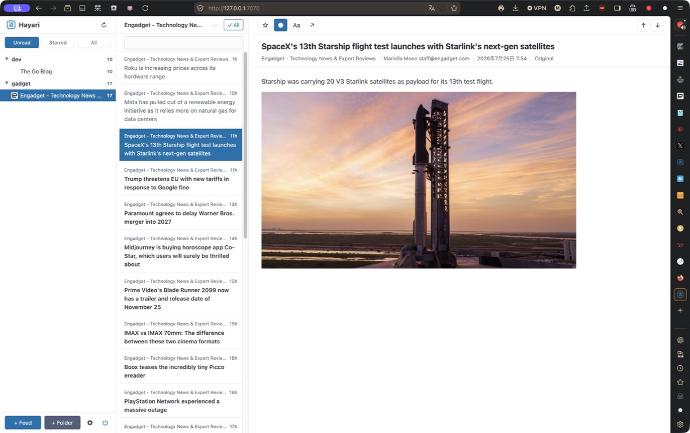

# Hayari

[日本語版](README.ja.md)

A self-hosted RSS aggregator written in Go with a vanilla JS frontend.
The name Hayari comes from the Japanese word 「流行り」, meaning a trend or something in vogue.

## Features

- Single binary with embedded frontend assets
- SQLite database (no external DB required)
- Desktop tray icon support (build with `gui` tag)
- FreshRSS `greader.php`-compatible API subset
- Per-feed title keyword exclusions (literal substring match)
- Lightweight UI with self-hosted CSS (no CSS framework dependency)

## Screenshot

Feeds, unread counts, article list, and reading pane after adding feeds. The
Engadget feed is selected with an article open.



## Keyboard shortcuts

| Key | Action |
| --- | --- |
| `j` / `k` | Select the next / previous article |
| `l` / `h` | Select the next / previous feed or folder |
| `o` | Open the selected article in the browser |
| `r` | Toggle the selected article's read state |
| `s` | Toggle the selected article's star |
| `i` | Toggle readability mode |
| `q` | Close the article pane |
| `f` / `b` | Scroll the article down / up |
| `/` | Focus search |
| `Shift+R` | Mark all articles in the current view as read |
| `1` / `2` / `3` | Switch to Unread / Starred / All |

Shortcuts are disabled while typing in an input field or while a dialog is open.

## Building

```sh
# Server-only build
make build

# Desktop tray build
make build-gui
```

## Running

```sh
./hayari --addr 127.0.0.1:7070 --db path/to/hayari.db --user your-user --pass your-password
```

### Optional: title translation with Henji

Hayari can translate unread article titles from English to Japanese through
[Henji](https://forge.harakara.site/littleisland/henji). Henji is an optional
external command: configure its provider credentials separately, then Hayari
uses `henji` on `PATH` (or a path supplied with `--henji-path`). If it is not
available, the **AI** button is hidden and all other Hayari features continue
to work normally.

Henji's API key and provider configuration stay in Henji. Hayari never reads,
stores, or exposes them. When you confirm translation in the Web UI, eligible
unread titles (up to 50) are sent to the provider configured in Henji.

By default, Hayari uses `openrouter / google/gemini-2.5-flash-lite`:

```sh
# Use henji on PATH
./hayari --henji-path henji

# Use a specific Henji executable
./hayari --henji-path /opt/bin/henji

# Override provider and model together
./hayari --henji-api openrouter --henji-model example/model
```

`--henji-api` and `--henji-model` must be supplied together. Translation is
started manually from the AI button for a selected feed, runs in the background,
and has no progress or completion notification. Reload the list later to see
translated titles. Failed or skipped titles remain in their original language.

Only Hayari's Web UI displays translated titles and searches both original and
translated titles. FreshRSS / Google Reader-compatible clients continue to
receive the original title.

## Secure deployment

Hayari does not provide TLS itself. Run it only behind a TLS-terminating reverse proxy such as Caddy or nginx:

```text
Browser / RSS client -- HTTPS --> reverse proxy -- HTTP --> Hayari (127.0.0.1:7070)
```

- Bind Hayari to loopback when the proxy is on the same host, or to its private interface when the proxy is in another LXC; do not expose its HTTP listener directly to the internet.
- Configure the reverse proxy to redirect HTTP to HTTPS.
- Always configure `--user` and `--pass` in production. Without both, Hayari permits requests without authentication for local development.
- Hayari refuses an unauthenticated listener outside loopback by default. `--allow-insecure-no-auth` overrides this only for intentional local/testing use.
- Treat the proxy access log as sensitive because it includes requested URLs.
- When the proxy terminates HTTPS, start Hayari with `--secure-cookie` so browser session cookies are sent only over HTTPS.

### Login failure limits behind Caddy

Set `HAYARI_TRUSTED_PROXIES` in Hayari's environment to the IP addresses from
which Caddy connects to Hayari. It accepts comma-separated IPv4/IPv6 literals
(for example, `127.0.0.1,::1`), with optional surrounding whitespace. Hostnames,
CIDR ranges, ports, and empty entries are invalid and cause a startup error.
Unset or empty means forwarded headers are ignored.

Only when the actual TCP peer matches a configured address does Hayari use the
rightmost IP in `X-Forwarded-For`, which [Caddy sets or appends by default](https://caddyserver.com/docs/caddyfile/directives/reverse_proxy#defaults).
Hayari does not trust an arbitrary first value. If XFF is absent or its last
value is not an IP literal, Hayari uses the TCP peer IP.

Web `/login`, `/accounts/ClientLogin`, and
`/api/greader.php/accounts/ClientLogin` share the same client-IP failure counter:
five failed logins lock that IP for 15 minutes. With the proxy configured,
another client behind the same Caddy can still log in; its successful login
does not clear the locked client's failures.

When Caddy and Hayari are in the **same LXC**:

```sh
HAYARI_TRUSTED_PROXIES=127.0.0.1,::1 ./hayari \
  --addr 127.0.0.1:7070 --user your-user --pass your-password --secure-cookie
```

```caddyfile
hayari.example.com {
    reverse_proxy 127.0.0.1:7070
}
```

For IPv6 loopback, use `--addr '[::1]:7070'` and `reverse_proxy [::1]:7070`.

When Caddy and Hayari are in **separate LXCs**, for example Caddy at
`10.0.0.10` and Hayari at `10.0.0.11`:

```sh
HAYARI_TRUSTED_PROXIES=10.0.0.10 ./hayari \
  --addr 10.0.0.11:7070 --user your-user --pass your-password --secure-cookie
```

```caddyfile
hayari.example.com {
    reverse_proxy 10.0.0.11:7070
}
```

Use the Caddy source IP actually seen by Hayari, including any NAT translation.
Keep the Hayari listener reachable only over the intended private network.
For systemd, put `Environment="HAYARI_TRUSTED_PROXIES=10.0.0.10"` (or the
loopback list) in Hayari's `[Service]` configuration, then reload the unit and
restart Hayari. The setting is read at startup; no custom Caddy XFF header
configuration is needed for these examples.

### Basic authentication for local automation

The Web UI's REST API uses the cookie issued by Web login. AI agents and scripts
can also use Basic authentication from a loopback client IP only
(`127.0.0.0/8` for IPv4 or `::1` for IPv6). Basic authentication from other
client IPs, including private LAN addresses, is rejected.

```sh
curl --user your-user:your-password http://127.0.0.1:7070/api/status
```

The client IP is resolved in the same way as the login failure limit.
**Always configure `HAYARI_TRUSTED_PROXIES` as shown above when using Caddy.**
Without it, Caddy in the same LXC makes external requests appear to come from
loopback, so Basic authentication cannot be restricted to local clients.
If Hayari listens on loopback, the direct command above still works when Caddy
is configured as a trusted proxy.

When Hayari listens only on its private IPv4 address, as in the separate-LXC
example, run this command **inside Hayari's LXC**, using its listening address
and selecting loopback as the source:

```sh
curl --interface 127.0.0.1 --user your-user:your-password http://10.0.0.11:7070/api/status
```

External RSS clients use `ClientLogin` and token authentication through the
GReader-compatible API. Remote scripts that need the Web UI's REST API must use
a cookie obtained from `/login`.

### Google Reader login

`POST /accounts/ClientLogin` is the default and supported login method. Credentials in a GET query can be recorded in proxy access logs, so GET is disabled by default.

For a legacy client that requires GET, explicitly opt in:

```sh
./hayari --allow-greader-login-get
```

Use this only behind HTTPS and restrict access to proxy logs.

## API

Hayari implements a FreshRSS `greader.php`-compatible subset of the Google
Reader API. Both endpoint forms provide the same API:

- Google Reader form: `/accounts/ClientLogin` and `/reader/api/0/...`
- FreshRSS form: `/api/greader.php/accounts/ClientLogin` and
  `/api/greader.php/reader/api/0/...`

The implementation is verified with ReadKit and NetNewsWire. It supports
authentication, subscription and folder synchronization, unread and starred
state, article retrieval, `edit-tag`, and mark-all-as-read.

It is not a complete implementation of either API. For example, `rename-tag`
and `disable-tag` are not implemented because they are outside the verified
client workflows. See [the API reference](docs/freshrss-api.md) for the
supported endpoint set and limitations.

## License

MIT
